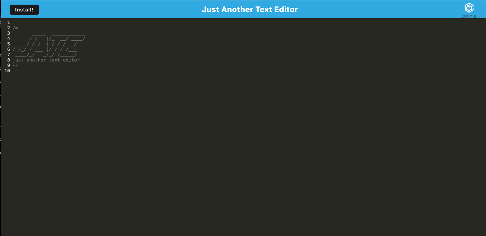
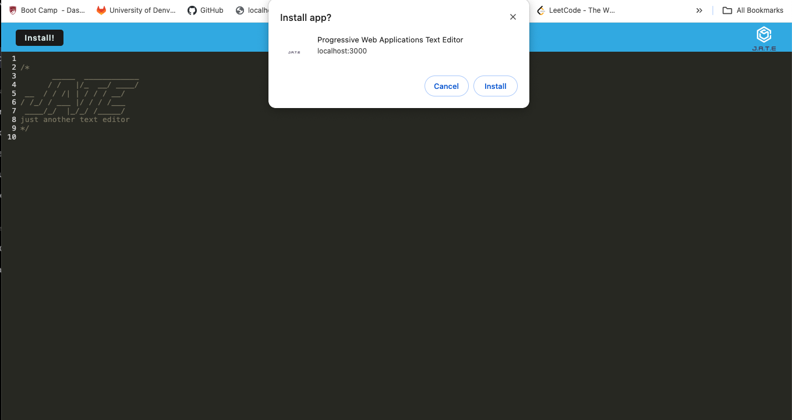
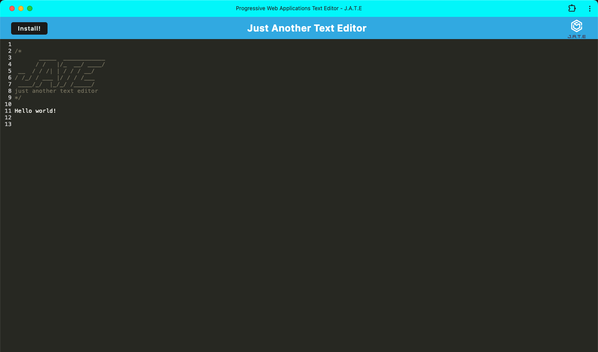

# Text Editor

[](https://opensource.org/licenses/MIT)

[Link to live deploy]()

## Description

As a developer, I built a text editor web application that allows users to create notes or code snippets with or without an internet connection. It features a client-server folder structure and is designed to be run using npm commands. The frontend, built with webpack, utilizes next-gen JavaScript and ensures functionality in the browser without errors. The application employs IndexedDB for immediate database storage, enabling users to save and retrieve content even after closing and reopening the text editor.

## Table of Contents

- [Installation](#installation)
- [Usage](#usage)
- [Badges](#badges)
- [Collaborators](#collaborators)
- [Features](#features)
- [Questions](#questions)

## Installation

1. **Clone the Repository**
   ```
   git clone https://github.com/ltrokey/pwa_text_editor
   cd pwa_text_editor
   ```
2. **Install Dependencies**

   ```
   npm i
   ```

   **Dependencies**

   - This application utilizes Node.js along with the following key dependencies:

   ```
    express
    codemirror
    @babel/core
    @babel/plugin-proposal-object-rest-spread
    @babel/plugin-transform-runtime
    @babel/preset-env
    @babel/runtime
    babel-loader
    css-loader
    eslint
    html-webpack-plugin
    http-server
    style-loader
    webpack
    webpack-cli
    webpack-dev-server
    webpack-pwa-manifest
    workbox-webpack-plugin
   ```

## Usage

1.  Run the Application

    - After following the installation instructions, execute the application by running the following command:

    ```
    npm run start
    ```

2.  Application Instructions:

    - Open the text editor web application in your browser.

    

    - Look for the "Install" button within the application interface.

    - Click on the "Install" button to initiate the installation process.

    - Follow any on-screen prompts or instructions that may appear.

    

    - Once the installation is complete, you should find the application icon on your desktop or in your designated installation location.

    - Double-click on the application icon to launch and start using the text editor.

    

## Collaborators

- Starter code was provided for this application.

## Badges


## Features

1. Offline Editing:

   The application allows users to create and edit notes or code snippets without an internet connection, ensuring productivity even in offline environments.

2. Client-Server Structure:

   The application follows a clear client-server folder structure, promoting modularity and maintainability in the codebase.

3. npm Commands:

   Developers can easily start the application using the npm run start command from the root directory, which initiates both the backend server and serves the client.

4. Webpack Bundling:

   JavaScript files are bundled using webpack, optimizing the application for performance and reducing load times.

5. Generated Files:

   Running webpack plugins results in a generated HTML file, service worker, and manifest file, streamlining the deployment process.

6. Next-Gen JavaScript Support:

   The application supports next-generation JavaScript features, ensuring compatibility and efficient execution in modern browsers.

7. IndexedDB Integration:

   The use of IndexedDB immediately creates a database storage for the application, allowing seamless saving and retrieval of content even after closing the text editor.

8. Persistent Content:

   Content entered into the text editor is automatically saved to IndexedDB when the user clicks off the DOM window, providing a persistent and reliable storage mechanism.

9. Installable as Desktop Icon:

   Users can click on the "Install" button to download the web application as an icon on their desktop, enhancing accessibility.

10. Service Worker with Workbox:

    The application has a registered service worker implemented with Workbox, enabling offline access and pre-caching static assets for improved performance.

11. Render Deployment Support:

    The deployment process is optimized for platforms like Render, with proper build scripts tailored for a webpack application.

## Questions

[GitHub Profile](https://github.com/ltrokey)

Please feel free to contact me via the email link below.

[Email](mailto:trokeyln@gmail.com)
